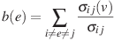

# Edge-based control of disease propagation through the world-wide airport network
Nicholas A. Yager 1 and Matthew Taylor 2

1 Department of Biochemistry, State University of New York at 
Geneseo, Geneseo, New York 14454 
2 Department of Biology, State University of New York at Geneseo, 
Geneseo, New York 14454

## Abstract

Airplanes serve as vital transportation in a highly globalized and
interconnected economy. Unfortunately, airplanes make it extremely easy for
specific pathogens to propagate quickly and effectively to distant parts of
the world. To model the spread of a pathogen through air routes, a directed
network was generated using existing airports as vertices and their associated
routes as edges. Airports were infected for a certain amount of time before
they recover. Multiple strategies to decrease the number of infected airports
were studied at a variety of efforts, or the percentage of total flights to be
canceled, to determine the most appropriate flights to cancel. We found that
by canceling flights based on edge betweenness centrality and clustering
coefficient resulted in a significant reduction in the number of airports
harboring infectious individuals. We also examined the effect of delaying our
cancellation strategy on the number of airports harboring infectious
individuals. We found that the greatest increase in the number of infections
occurs after one week of delay, although any delay causes a statistically
significant increase in the number of infections. Based on these results we
suggest that the World Health Organization and the IATA develop an adequate
response plan to cancel flights based on betweenness centrality and clustering
coefficient in the event of a serious epidemic.

## Introduction

The connections that connect all of humanity form a large network of 
interactions and relationships. In recent years, these network edges have
come under scrutiny in the modeling of information though social networks,
the spread of people though transportation networks, and the prediction of
infectious disease within populations.

Most of these real-world networks are defined as as small-world networks;
networks that are characterized by a power-law decaying degree distribution and 
a high average clustering coefficient [[1][1]]. Interestingly, 
using airports as network vertices and routes as network edges provides a
massive small-world network that reflects the travel needs of 2.86 annual
airline passengers per year.

Previous research into infectious disease in small-world networks has 
highlighted the importance of the structural connections in the spread of
disease [[2][2]]. To explore the effect of the connections between
airports, we ran simulations of the spread of a disease through the airline
network and implemented betweenness centrality- and clustering coefficient-based
flight cancellation strategies.
 
## Methods

Using python and NetworkX, a network consisting of airports as nodes and
airline routes as edges was constructed with data from
[openflights.org](http://openflights.org/data) as shown in Figure 1. Nodes
without inbound or outbound edges were removed. In addition, redundant edges
were removed from the network.

<b>Figure 1: Plot 
of the modified network exhibits degree stratification..</b> The light blue 
vertices represent susceptible airports. Simulations start with 10 airports with 
infectious individuals. The edges these individuals can travel on are colored 
green. The separation of the tight clusters in the center from the rest of the
graph suggests that the network is highly stratified in the types of connections
between airports.
 

Examination of the properties of our network yielded 39,467 edges, 3,308 
vertices and has a diameter of three. We also examined the degree distribution
for the airports in the network. As shown in Figure 2, the distribution follows
a power law, where the vast majority of airports worldwide are smaller regional
airports with 2 to 20 inbound and outbound flights. Additionally, there are few
airports that have between 300 and 400 inbound and outbound flights.

<b>Figure 2: Degree
distribution for the airport network.</b> The network exhibits a power law, with
over 700 airports with a degree of 3 or less. Additionally, there are very few 
airports with a degree higher than 400. This implies that the topology of the 
network favors using a small number of international hubs to carry traffic 
between a large number of smaller regional airports.
 

We also examined the degree distribution of both a high and low degree airport's
neighbors to better understand the sort of airports hub airports and regional 
airports are connected to. As seen in Figure 3, the distributions for large 
airports and small airports are highly distinct. In the case of the degree 
distribution for Hartfield-Jackson Atlanta International Airport, ATL is 
connected to a wide variety of airports, including low-degree airports such as
regional airports, as well as other high-degree hub airports. In contrast, 
Greater Rochester International Airport, a low-degree regional airport 
regardless of name, is connected almost entirely to airports with a degrees 
between 200 and 500.

<b>Figure 3: Degree
distribution for the neighbors of ATL and ROC highlights differences in network
connectivity.</b> As shown in the degree distribution for ATL's neighbors, ATL 
is connected to a wide variety of different size airports. Although ATL is 
primarily connected to airports with a degree between 12 and 54, it is also 
connected to airports with a degree of two as well as airports with a degree 
over 400. This is contrasted to ROC, which is connected primarily to airports 
with between 200 and 400 connections. This would suggest that high-degree hubs 
like ATL serve as connecting stops for flights to and from smaller airports. 
From this, we can assume that there will be more traffic traveling from small 
airports to international hubs, than there will be from an international hub to 
a particular regional airport.
 

To examine the propagation of disease through the network, we implemented an
example disease based upon influenza A. As such, there were four states,
susceptible, exposed, infectious, and recovered. The infection took three days
to incubate and 7 days to recover from, and as such was observed to have a basic 
reproductive rate of 2.32. Using the aforementioned example disease, 
the model propagated the disease by following five rules:

  1. The disease starts randomly from 10 airports, with a higher probability of
        starting in high-degree airports.
  2. One plane leaves on every outbound route every tick and arrives at its 
        destination.
  3. Airports are used as proxies for individuals harbored within the airport.
        This assumption is held witht he understanding that transient passengers
        are able to infect perminant employees of the airport. These employees
        are then able to pass the infection on to other individuals in the 
        airport.
  4. Routes are directional, and each edge is weighted to represent the 
        probability of carrying infectious individuals based upon the degree of 
        the source and destination airports.
  5. Edge weights are recalculated after each cancellation strategy to properly
        model the flow of individuals around our cancellations. 

To test our ability to limit the number of infections in the network, we
implemented a strategy of canceling flights based on edge betweenness 
centrality, clustering coefficient summation, and a random implementation. For
this, we calculated the betweenness centrality from each edge *i* to each other
edge *j*, where σij is the number of shortest paths from *i* to *j*,
such that

 

The clustering coefficient summation is assigned to edgeij as the 
sum of the clustering coefficients of vertices *i* and *j*. The random strategy 
randomly closes an edge in the network.

## Results

Propagation of the infection through the network can be seen in Figure 4. 
Starting with 10 randomly chosen airports of high degree, infectious 
individuals, as depicted in green, propagate along the green-colored edges. As
time continues, the majority of airports infected are the highly connected 
airports in the center of the graph. This can be compared to the less-connected
regional or public airports seen on the periphery of the graph. The simulation
seen in Figure 4 suggests that infections are most likely to occur in the larger
international airports, making them valid targets for cancellations and 
quarantine.

<b>Figure 4: 
Propagation of the disease favors highly connected airports near the graph
center.</b> The infection starts in the 10 most connected airports in the 
network. As a result of how network weights are applied, infections are more 
likely to be spread to other large airports. This trend is easily visualized as 
the airports in the center of the graph are infected more often. Smaller 
regional airports on the periphery of the graph are sometimes infected, but the 
rate of infection is much lower when distant from the central, highly connected 
networks. 
 

To collect a large enough sample size, 343 simulations were performed for each
strategy at 20 cancellation efforts at a 5% interval. As such a total of 20,580
simulations were performed, and the number of airports harboring infected 
individuals was used to the determination of the optimal strategy. We chose to
examine five cancellation efforts, namely 0%, 10%, 30%, 50%, and 80%. All
strategies within the five cancellation efforts were determined to be normally 
distributed using a Shaprio-Wilk test (a = 0.05). An analysis of variance was
performed, and we found that strategy (D = 4, F = 52730.4, p < 0.001 ), effort 
(D = 2, F = 640.8, p < 0.001) and their interaction 
(D = 8, F = 2037.3, p < 0.001) were all significant factors.

A Tukey HSD test was performed, as shown in Figure 5. We found that in efforts under
30%, the application of a random cancellation strategy will increase the number
for airports containing infectious individuals. We also found that in high
cancellation efforts the clustering coefficient strategy resulted in the 
greatest decrease in the number of airports with infectious individuals. In
a moderate effort, such as 30%, betweenness centrality is the optimal strategy,
and is statistically different that the 30% clustering coefficient-based 
strategy. Specifically, a 30% betweenness centrality approach provides a mean
decrease of 32.1%, whereas a 30% clustering coefficient approach provided 
decrease of 30.9%. It should also be noted that a 50% cancellation effort
using a clustering coefficient strategy reduced the number of infections by 
49.3%.

<b>Figure 5: 
Betweenness centrality and clustering coefficient cancellation strategies prove
effective at moderate cancellation efforts.</b> The Tukey HSD test suggests that
a 30% betweenness centrality-based cancellation is statistically different from
the similar 30% clustering coefficient-based strategy. We also found that at 
very high cancellation efforts, the random strategy has better returns that all
others due to the random nature in which it totally disrupts the transportation
network.
 

We tested our cancellation strategies while implementing delays in when
cancellations took place. We tested delays of 0, 7, 14, 21, and 28 days. An 
one-way ANOVA test was performed, and we found that the effect of the delay
was statistically significant (DF = 4, F = 1291.4, p < 0.001). We also performed
a Tukey HSD test, and we found that each of the delays were statistically 
different. The critical point in the effectiveness of the cancellation 
strategies seems to be around 14 days after infection. It should be noted,
however, that all delays decrease the effectiveness of our cancellation
strategies.

<b>Figure 6: 
Cancellation delay has a significant impact on the effectiveness of cancellation
strategies.</b> A Tukey HSD test applied to delayed cancellation strategies. The
test suggests that all of our tested delays were statistically significant. In 
addition, we found that the delay with the greatest change in the number of 
airports with infectious individuals is around the 14 day mark.

 

## Discussion
The cancellation of specific airline routes effectively mitigates the spread of
an infectious disease in the airline network. In the case of betweenness
centrality, previous findings support the efficacy of of edge betweenness
centrality in the control of an infectious disease [3][3].

Clustering coefficient-based flight cancellations are novel in that they target 
flights based on the clustering of their connecting airports. Since the 
clustering  coefficient targets vertices based on the degree to which they are 
connected to their local cluster, the metric tends to target routes between 
smaller regional airports as opposed to large international traffic hubs. As a
result, closed flights from smaller airports would tend to be lower traffic
flights between distinct economic markets.
 
As an interesting result of our model, some cancellation strategies result in a
net increase in the number of airport with infectious individuals. A random
cancellation strategy with a 10% effort effectively increases the number of
airports with infectious individuals by 7.6%. This novel result would suggest
that an inadequate response to cancellations would result in more infectious
individuals being rerouted to connecting airports that they would not have
traveled to under normal circumstances. The unintended consequence of 
increasing the number of infections lends credence to the necessity to choose 
wisely and act swiftly in the control of infectious diseases.

Our study is systematically different from other research of this type. Namely,
our simulations include all 3,308 viable airports and 39,467 routes. This 
contrasts with a study performed by Marcelino and Kaiser which focused only on
the largest 500 airports in the network [3][3]. Interestingly, our
data confirm their findings that connectivity plays a strong role in the spread
of disease globally. In addition to network size, our model is unique in that 
our stochastically-chosen starting locations provides us a more complete 
understanding of how the diseases propagates through the network as a whole. 

The testing of delays in cancellations provides us useful information about the
importance of when to implement a cancellation strategy. Our model suggests that
a control strategy should be in place in under a week for optimal results. The
model also predicts that after two weeks the number of airports with infectious
individuals will increase by as much as 20%. As stated by Walter Gaber in 2009,
the ability to detect infectious diseases and properly control them becomes 
crucial [4][4].

In conclusion, our results suggest that flight cancellations can be an effective
means of controlling the propagation of disease. Furthermore, we recommend  a 
strategy based on betweenness centrality or clustering coefficient implemented
within a week of initial exposure.

## References

1. Amaral LAN, Scala A, Barthelemy M, Stanley HE. 2000 *Classes of small-world
    networks*. *Proc. Nat. Acad. Sci.* 97;21. DOI: doi: 10.1073/pnas.20032719.
2. Amaral LAN, Guimera R. 2004 *Modeling the world-wide airport network.*
    *Eur. Phys. J B*. 38, 381-385. DOI: 10.1140/epjb/e2004-00131-0.
3. Marcelino J, Kaiser M. 2012 *Critical paths in a metapopulation model of
    H1N1: Efficiently delaying influenza spreading through flight cancellation.*
    *PLoS Curr.* April 23. DOI: 10.1371/4f8c9a2e1fca8.
4. Garber W, Goetsch U, Diel R, Doerr HW, Gottschalk R. 2009 *Screening for
    Infectious Diseases at International Airports: The Frankfurt Model*.
    *Aviat Space Environ Med* 80:595-600.
[1]: http://www.pnas.org/content/97/21/11149.long
[2]: http://etseq.urv.cat/seeslab/media/publication_pdfs/Guimera-2004-Eur.Phys.J.B-38-381.pdf
[3]: http://www.ncbi.nlm.nih.gov/pmc/articles/PMC3392097/ 
[4]: http://eagosh.org/cmsv6/eagosh-files/articles_presentations_infos/international_health_regulations/asma_090707_s1.pdf
